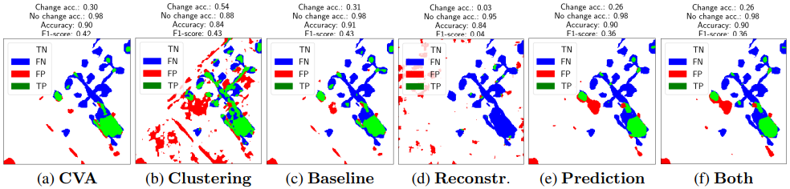

# Change detection with masked image modeling

Change detection is extremely important as it helps us automatically evaluate the evolution of different developments throughout the globe.

In this project, we implemented different change detection techniques based on the reconstruction of satellite images.

We used data from two very well-known annotated datasets for satellite change detection. The first one is [SZTAKI][sztaki], introduced by Benedek et al. and the second one is [OSCD][oscd] introduced by Daudt et al.

Then, we implemented our change detection models based on [Masked Autoencoders][mae]. Recently, Girdhar et al. introduced [OmniMAE][omnimae], a masked autoencoder model designed to handle videos.

Our contribution is two-fold. First, we tried to apply OmniMAE for unsupervised change detection on satellite images. Then, we introduce OmniMAECNN, which corresponds to a OmniMAE base together with a CNN head for supervised change detection.

Our results are compared to unsupervised (change vector analysis, k-means) and supervised (FresUNet) methods and can be found in our report under *report/report.pdf*

Please refer to the following sections for more information about the package usage:

1. [Some results](#some-results)
2. [Installation](#installation-instructions)
3. [Description](#package-description)
4. [Usage via command lines](#package-usage)
5. [Documentation](#documentation)

## Some Results

Let **1** denote the first image and **2** denote the last image.

Here, we plot the comparison of unsupervised change detection methods on SZTAKI dataset. OmniMAE is fed with a video ordering **1122** and no masking is applied.



The quantitative results for unsupervised change detection methods are summed up in the following table.

| Method         | Global acc. | Precision                                                                              | Recall | F-score |
| ------------- | ------------- | ------------------------------------------------------------------------------------- | ------ | ------- |
| **CVA** | 93.58       | 39.20                                                        | 36.66 | 37.88 |
| **Clustering**      | 92.52       | 30.82                                                         | 32.03 | 31.41 |
| **Baseline loss**   | **93.69**       | **40.32**                       | **37.71** | **38.98** |
| **OmniMAE**      | 93.28       | 36.24                       | 33.90 | 35.03 |

Here, we plot the comparison of supervised change detection methods on OSCD dataset. OmniMAECNN is fed with a video ordering **1221** and a random masking of 80% of all patches.


The quantitative results for supervised change detection methods are summed up in the following table.

| Method         | Bands | # Params | Global acc. | Precision                                                                              | Recall | F-score |
| ------------- | ------ | ---- | --- | ------------------------------------------------------------------------------------- | ------ | ------- |
| **FresUNet** | RGB | 1,103,874 | 93.66       | 42.20                                                        | 50.30 | 45.89 |
| **FresUNet**      | Res20 | 1,104,994 | **95.05**       | **53.61**                                                         | **54.89** | **54.25** |
| **OmniMAECNN**   | RGB | 1,769,855 | 94.21       | 44.30                       | 32.20 | 37.29 |
| **OmniMAECNN**      | Res20 | 5,907,150 |  93.67    | 42.46                    | 51.87 | 46.70 |

## Installation instructions

In order to use our package and run your own experiments, we advise you to set up a virtual environment.

You will need Python 3 and the *virtualenv* package:

    pip3 install virtualenv

Then, create your virtual environment and switch to it:

    python3 -m venv venv

    source venv/bin/activate (Linux)
    .\venv\Scripts\Activate.ps1 (Windows PowerShell)

You will need to install the *omnivore*, *omnivision* and *omnimae* packages locally using:

    pip3 install -e . --extra-index-url https://download.pytorch.org/whl/cu118

Finally, install all the requirements:

    pip3 install -r requirements.txt (Linux)
    pip3 install -r .\requirements.txt (Windows PowerShell)

*Note*: Tested on Linux with Python 3.10.9 and on Windows with CUDA 11.8. For Windows, you might also need to install the corresponding CUDA Toolkit.

## Package description

Below, we give a brief tree view of our package.

    .
    ├── doc  # contains a generated documentation of src/ in html
    ├── omnimae  # contains the original OmniMAE code
    ├── omnivision  # changes brought to VisionTransformer
    ├── omnivore  # contains the original Omnivore code
    ├── report  # contains our complete report in pdf format
    ├── src  # source code
    |   ├── datasets
    |   |   ├── __init__.py
    |   |   ├── hub.py
    |   |   ├── onera_dataset.py  # load ONERA data
    |   |   ├── sztaki_dataset.py load SZTAKI data
    |   |   └── transforms.py load SZTAKI data
    |   ├── models  # sampling techniques for data imputation
    |   |   ├── __init__.py
    |   |   ├── clustering.py  # unsupervised baseline (based on k-means)
    |   |   ├── cva.py  # unsupervised baseline (change vector analysis)
    |   |   ├── fresunet.py  # supervised baseline (FresUNet)
    |   |   ├── images_to_video.py  # convert images to a fake video
    |   |   ├── omnimae_loss.py  # convert OmniMAE output back to images
    |   |   ├── omnimae.py  # OmniMAE-based reconstruction and change detection models
    |   |   └── trainer.py
    |   ├── utils
    |   |   ├── __init__.py
    |   |   ├── conversion.py  # conversion utils for visualization
    |   |   ├── data.py
    |   |   ├── image_processing.py  # filtering and equalization
    |   |   ├── misc.py
    |   |   └── plotting.py
    |   ├── __init__.py
    |   ├── change_detection.py  # main file to train models for change detection
    |   └── reconstruction.py  # main file to reconstruct satellite images
    ├── README.md
    ├── inference_omnimae.ipynb  # try out OmniMAE on simple reconstruction tasks
    ├── inference_tutorial.ipynb  # from original omnivore codebase
    ├── setup.py  # to install omnivore locally plus required Python packages
    └── requirements.txt  # contains the required Python packages to run our files

## Package usage

Our implementation on top of OmniMAE for change detection can be found under the *src/models/omnimae.py* file. There are also notebooks for ease to use.

You can download OSCD [here](https://rcdaudt.github.io/oscd/) and unpack it under *data/OSCD* and you can download SZTAKI [here](http://mplab.sztaki.hu/remotesensing/airchange_benchmark.html) and unpack it under *data/sztaki*.

### Notebooks

In order to use the notebooks, you will also need to install *jupyter*:

    pip3 install jupyter notebook ipykernel
    ipython kernel install --user --name=myvenv

There are two available notebooks:

- inference_tutorial.ipynb: this notebook allows to check that Omnivore works on your machine
- inference_omnimae.ipynb: this notebook allows to check that OmniMAE works on your machine

### Reconstruction

The main file to use for experimenting is *src/reconstruction.py*. The command is as follows:

    python3 src/reconstruction.py [options]

- `--seed`: Seed to use everywhere for reproducibility. Default: 42.
- `--data-dir`: Name of the directory where data is stored. Default: "data".
- `--dataset-name`: Name of the dataset to use. Default: "OSCD".
- `--city-name`: Name of the city inside dataset. Default: "beirut".
- `--sub-name`: For SZTAKI dataset, there are several images per city. Default: "1".
- `--percentiles`: Percentiles for saturation in the initial preprocessing of images. Default: 2.
- `--cropping-method`: Cropping method, either "random" for random cropping of 224x224 part of the image or - "fixed" for a choice using `--left`, `--top`, `--right` and `--bottom`. Default: "random".
- `--left`: Left limit for initial cropping of satellite images. Default: 0.
- `--top`: Top limit for initial cropping of satellite images. Default: 0.
- `--right`: Right limit for initial cropping of satellite images. Default: 1.
- `--bottom`: Bottom limit for initial cropping of satellite images. Default: 1.
- `--video-ordering`: For a given pair of images, where "1" designates the first one and "2" the last one, define a sequence of repeated images to be fed to the OmniMAE model as a video. Default: "1221".
- `--masking-method`: Masking method, either "random", "complementary" or "none" to mask out the whole images. When method is "random" or "complementary", set the proportion of masked patches (for "complementary", in the first image) using the `--masking-proportion` argument. Default: "none".
- `--masking-proportion`: When `--masking-method` is set to "random" or "complementary", set the proportion of masked patches, i.e. the proportion of patches which are not fed to the model. Default: 0.5.
- `--window-size`: Window size for median filtering of the loss. Use 0 to apply no filtering. Default: 4.
- `--percentile`: Threshold for change point detection on the loss. Default: 95.
- `--savefig`: If "True", figures will be saved on disk. Default: "True".
- `--results-dir`: Name of the directory where figures are stored. Default: "results".

*Example*: In order to reproduce our results, run the following commands.

```bash
python3 src/reconstruction.py --seed 42 --data-dir data --dataset-name sztaki --city-name Szada --sub-name 2 --video-ordering 1122 --masking-method none --window-size 4 --percentile 95 --savefig True --results-dir results
[...]
python3 src/reconstruction.py --seed 42 --data-dir data --dataset-name sztaki --city-name Szada --sub-name 2 --video-ordering 1221 --masking-method none --window-size 4 --percentile 95 --savefig True --results-dir results
[...]
python3 src/reconstruction.py --seed 42 --data-dir data --dataset-name sztaki --city-name Szada --sub-name 2 --video-ordering 1122 --masking-method complementary --masking-proportion 0.5 --window-size 4 --percentile 95 --savefig True --results-dir results
[...]
python3 src/reconstruction.py --seed 42 --data-dir data --dataset-name sztaki --city-name Szada --sub-name 2 --video-ordering 1221 --masking-method complementary --masking-proportion 0.5 --window-size 4 --percentile 95 --savefig True --results-dir results
[...]
python3 src/reconstruction.py --seed 42 --data-dir data --dataset-name sztaki --city-name Szada --sub-name 2 --video-ordering 1122 --masking-method random --masking-proportion 0.8 --window-size 4 --percentile 95 --savefig True --results-dir results
[...]
python3 src/reconstruction.py --seed 42 --data-dir data --dataset-name sztaki --city-name Szada --sub-name 2 --video-ordering 1221 --masking-method random --masking-proportion 0.8 --window-size 4 --percentile 95 --savefig True --results-dir results
[...]
```

### Change detection

The main file for training models for change detection is *src/change_detection.py*. The command is as follows:

    python3 src/change_detection.py [options]

- `--seed`: Seed to use everywhere for reproducibility. Default: 42.
- `--bands-name`: Name of the bands to use in the images. Choose from "rgb", "nir", "res20" and "all". Default: "rgb".
- `--patch-size`: Size of the cropped images for training. Models based on OmniMAE only support 224. Default: 224.
- `--normalize`: If "True", normalize input images. Default: "True".
- `--fp-modifier`: Should be used with caution. Default: 10.
- `--model-name`: Name of the model to use for change detection. Choose from "fresunet", "omnimae", "omnimaecnn" and "omnimaefresunet". Default "fresunet".
- `--video-ordering`: For a given pair of images, where "1" designates the first one and "2" the last one, define a sequence of repeated images to be fed to the OmniMAE model as a video. only used for OmniMAE models. Default: "1221".
- `--masking-method`: Masking method, either "random", "complementary" or "none" to mask out the whole images. When method is "random" or "complementary", set the proportion of masked patches (for "complementary", in the first image) using the `--masking-proportion` argument. Default: "none".
- `--masking-proportion`: When `--masking-method` is set to "random" or "complementary", set the proportion of masked patches, i.e. the proportion of patches which are not fed to the model. Default: 0.5.
- `--finetune`: If "True", finetune first and last layers of OmniMAE. Default: "True".
- `--checkpoints-dir`: Name of the directory where checkpoints are loaded and / or saved. Default: "checkpoints".
- `--load-checkpoint`: If "True", load checkpoint from disk. Default: "False".
- `--save-checkpoint`: If "True", save checkpoint to disk. Default: "True".
- `--batch-size`: Batch size for training the model. Default: 12.
- `--epochs`: Number of training epochs. Default: 50.
- `--savefig`: If "True", figures will be saved on disk. Default: "True".
- `--results-dir`: Name of the directory where figures are stored. Default: "results".

*Example*: In order to reproduce our results, run the following commands.

```bash
python3 src/change_detection.py --bands-name rgb --model-name omnimae --video-ordering 1122 --masking-method none --finetune False --checkpoints-dir checkpoints --load-checkpoint False --save-checkpoint False --results-dir results
[...]
python3 src/change_detection.py --bands-name rgb --model-name omnimae --video-ordering 1221 --masking-method none --finetune False --checkpoints-dir checkpoints --load-checkpoint False --save-checkpoint False --results-dir results
[...]
python3 src/change_detection.py --bands-name rgb --model-name omnimae --video-ordering 1122 --masking-method random --masking-proportion 0.8 --finetune False --checkpoints-dir checkpoints --load-checkpoint False --save-checkpoint False --results-dir results
[...]
python3 src/change_detection.py --bands-name rgb --model-name omnimae --video-ordering 1122 --masking-method random --masking-proportion 0.8 --finetune False --checkpoints-dir checkpoints --load-checkpoint False --save-checkpoint False --results-dir results
[...]
python3 src/change_detection.py --bands-name rgb --model-name fresunet --checkpoints-dir checkpoints --load-checkpoint False --save-checkpoint True --epochs 50 --results-dir results
[...]
python3 src/change_detection.py --bands-name res20 --model-name fresunet --checkpoints-dir checkpoints --load-checkpoint False --save-checkpoint True --epochs 50 --results-dir results
[...]
python3 src/change_detection.py --bands-name rgb --model-name omnimaecnn --video-ordering 1122 --masking-method none --finetune True --checkpoints-dir checkpoints --load-checkpoint False --save-checkpoint True --epochs 50 --results-dir results
[...]
python3 src/change_detection.py --bands-name rgb --model-name omnimaecnn --video-ordering 1221 --masking-method none --finetune True --checkpoints-dir checkpoints --load-checkpoint False --save-checkpoint True --epochs 50 --results-dir results
[...]
python3 src/change_detection.py --bands-name rgb --model-name omnimaecnn --video-ordering 1122 --masking-method complementary --masking-proportion 0.5 --finetune True --checkpoints-dir checkpoints --load-checkpoint False --save-checkpoint True --epochs 50 --results-dir results
[...]
python3 src/change_detection.py --bands-name rgb --model-name omnimaecnn --video-ordering 1221 --masking-method complementary --masking-proportion 0.5 --finetune True --checkpoints-dir checkpoints --load-checkpoint False --save-checkpoint True --epochs 50 --results-dir results
[...]
python3 src/change_detection.py --bands-name rgb --model-name omnimaecnn --video-ordering 1122 --masking-method random --masking-proportion 0.8 --finetune True --checkpoints-dir checkpoints --load-checkpoint False --save-checkpoint True --epochs 50 --results-dir results
[...]
python3 src/change_detection.py --bands-name rgb --model-name omnimaecnn --video-ordering 1221 --masking-method random --masking-proportion 0.8 --finetune True --checkpoints-dir checkpoints --load-checkpoint False --save-checkpoint True --epochs 50 --results-dir results
[...]
python3 src/change_detection.py --bands-name res20 --model-name omnimaecnn --video-ordering 1221 --masking-method random --masking-proportion 0.8 --finetune True --checkpoints-dir checkpoints --load-checkpoint False --save-checkpoint True --epochs 50 --results-dir results
[...]
```

## Documentation

A complete documentation is available in the *doc/src/* folder. If it is not
generated, you can run from the root folder:

```bash
pip3 install pdoc3
python3 -m pdoc -o doc/ --html --config latex_math=True --force src/
```

Then, open *doc/src/index.html* in your browser and follow the guide!

## References

Csaba Benedek and Tamas Sziranyi. *Change Detection in Optical Aerial Images by a Multi-Layer Conditional Mixed Markov Model*. in IEEE Transactions on Geoscience and Remote Sensing, vol. 47, no. 10, pp. 3416-3430. 2009.

Csaba Benedek and Tamas Sziranyi. *A Mixed Markov Model for Change Detection in Aerial Photos with Large Time Differences*. in International Conference on Pattern Recognition (ICPR), Tampa, Florida, USA. December 8-11, 2008.

Rodrigo Caye Daudt, Bertrand Le Saux, Alexandre Boulch and Yann Gousseau. *Urban Change Detection for Multispectral Earth Observation Using Convolutional Neural Networks.* 2018.

Kaiming He, Xinlei Chen, Saining Xie, Yanghao Li, Piotr Dollar and Ross Girshick. *Masked Autoencoders Are Scalable Vision Learners.* 2021.

Rohit Girdhar, Alaaeldin El-Nouby, Mannat Singh, Kalyan Vasudev Alwala, Armand Joulin and Ishan Misra. *OmniMAE: Single Model Masked Pretraining on Images and Videos.* 2022.

[//]: # (References)

[sztaki]: http://mplab.sztaki.hu/remotesensing/airchange_benchmark.html
[oscd]: https://rcdaudt.github.io/oscd/
[mae]: https://arxiv.org/abs/2111.06377
[omnimae]: https://github.com/facebookresearch/omnivore/tree/main/omnimae
